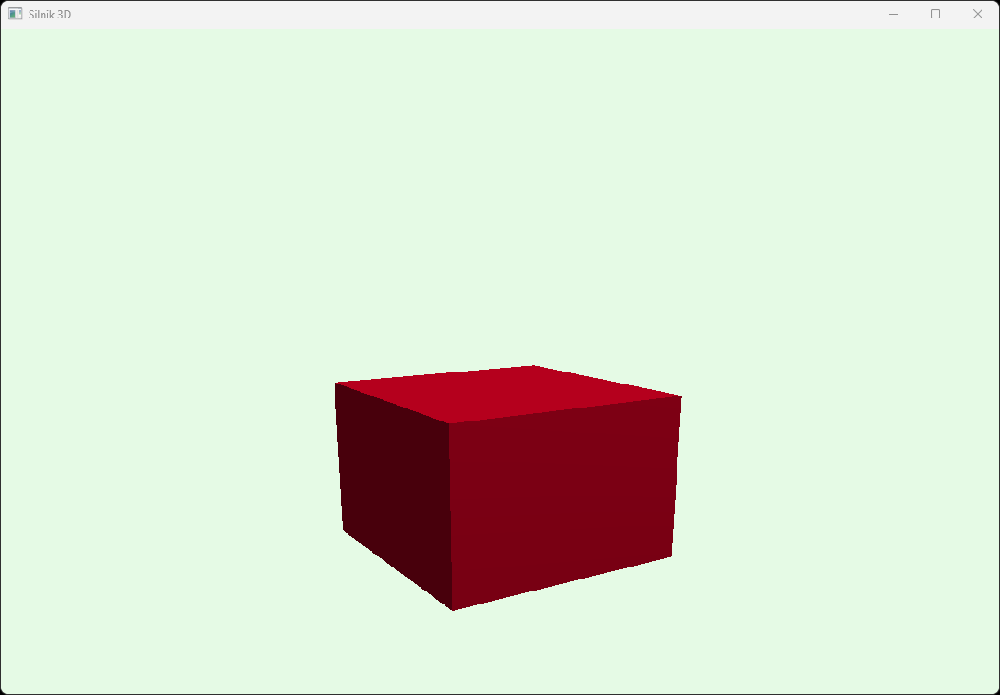

# 3D OpenGL Engine
Simple 3D graphic engine made in OpenGL which allows to draw 2D and 3D primitives. It also features texturing, simple lighting and camera movement. Engine developed in 2022.

## Technologies Used
### Languages
- C++
### Libraries
- OpenGL
- FreeGLUT
- glew
- glfw
- glm
- stb_image

## Example Screenshots
### Cube

